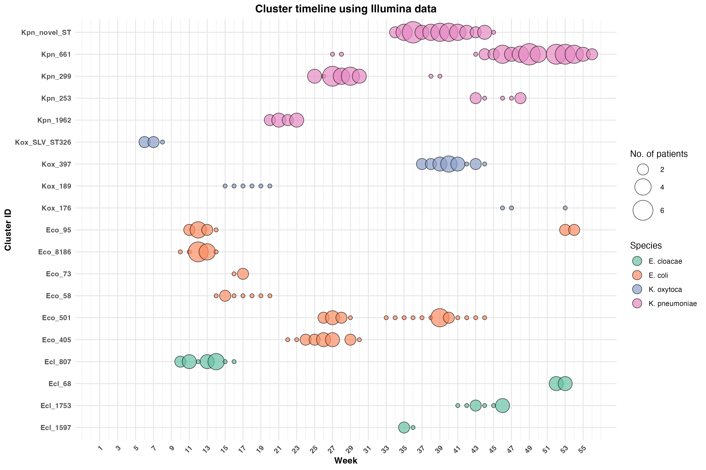

# Cluster Timeline Bubble Plot

Visualises weekly **Enterobacteriaceae cluster dynamics** from Illumina-based whole-genome sequencing data. Each bubble represents a unique sequence type (ST) active in a given week, with bubble size proportional to the number of unique patients carrying that ST.

---

## Output



---

## Requirements

- R ≥ 4.0
- `tidyverse`

Install dependencies:

```r
install.packages("tidyverse")
```

---

## Input

| File | Description |
|------|-------------|
| `figure1_metadata_160326.csv` | Metadata table with isolate-level information |

### Expected columns (in order)

| Column | Description |
|--------|-------------|
| `identifier` | Isolate identifier |
| `week` | Epidemiological week (numeric) |
| `ID` | Patient ID |
| `source` | Sample source |
| `Cluster` | Cluster name |
| `Cluster_ID` | Cluster ID (`singleton` entries are excluded) |
| `ST` | Sequence type |
| `species` | Species abbreviation (`Eco`, `Kpn`, `Ecl`, `Kox`) |

---

## Usage

```bash
Rscript cluster_bubble_plot.R
```

Or run interactively in RStudio. Ensure your working directory contains the input CSV.

---

## Output Files

| File | Format | Description |
|------|--------|-------------|
| `TAPIR_cluster_bubble_plot.svg` | SVG | Vector graphic (publication-ready) |
| `TAPIR_cluster_bubble_plot.png` | PNG (300 dpi) | Raster graphic |

---

## Methods Summary

1. Singletons are removed (clusters with only one isolate)
2. A `species_ST` label is created (e.g., `Eco_ST131`)
3. Unique patients per `week × species_ST` combination are counted
4. Bubbles are plotted with size = number of unique patients and fill = species

---

## Species Key

| Abbreviation | Full name |
|---|---|
| `Eco` | *Escherichia coli* |
| `Kpn` | *Klebsiella pneumoniae* |
| `Ecl` | *Enterobacter cloacae* |
| `Kox` | *Klebsiella oxytoca* |


## Acknowledgement 

This is an ongoing project at the Microbial Genome Analysis Group, Institute for Infection Prevention and Hospital Epidemiology, Üniversitätsklinikum, Freiburg. The TAPIR (Tracking the Acquisition of Pathogens in Real-Time) project led by [Dr. Sandra Reuter](https://www.uniklinik-freiburg.de/institute-for-infection-prevention-and-control/microbial-genome-analysis.html).
